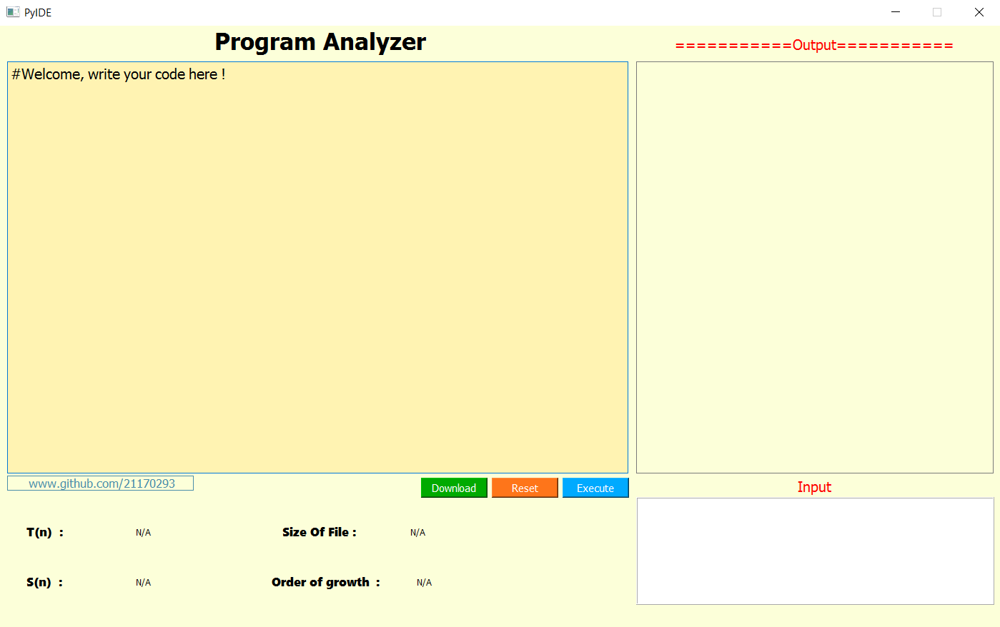

# PyIDE

<h2>Click here to Download--><a href="https://drive.google.com/open?id=14vRy415sqWU1p2YfgBhsRTikBMedW0Z5">PyIDE.exe</a></h2>

<h4>A coding editor initially build for Python language #RUN #DOWNLOAD CODE #EDIT  in single platform user friendly Software.</h4>

<h4>The vision about to build this IDE is to calcualte the TIME COMPLEXITY , SPACE COMPLEXITY, SIZE OF FILE , TIME TAKEN by program/code. </h4>

# BUGS

1> input() function is'nt working on run time
####ONLY USER DEFINED INPUT ACCEPTED ####
